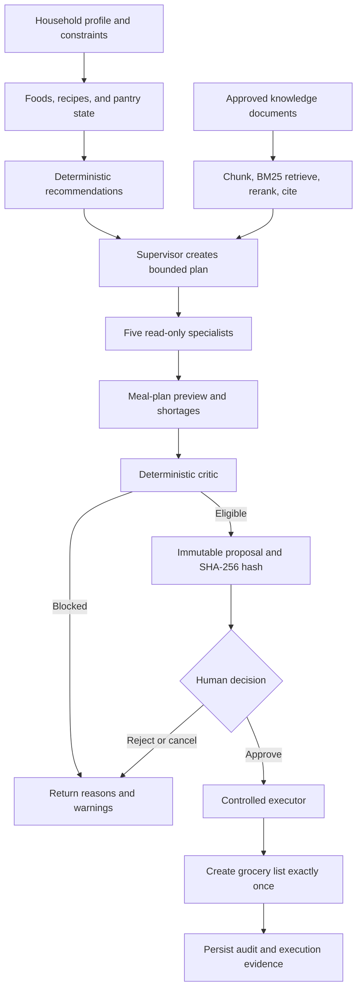
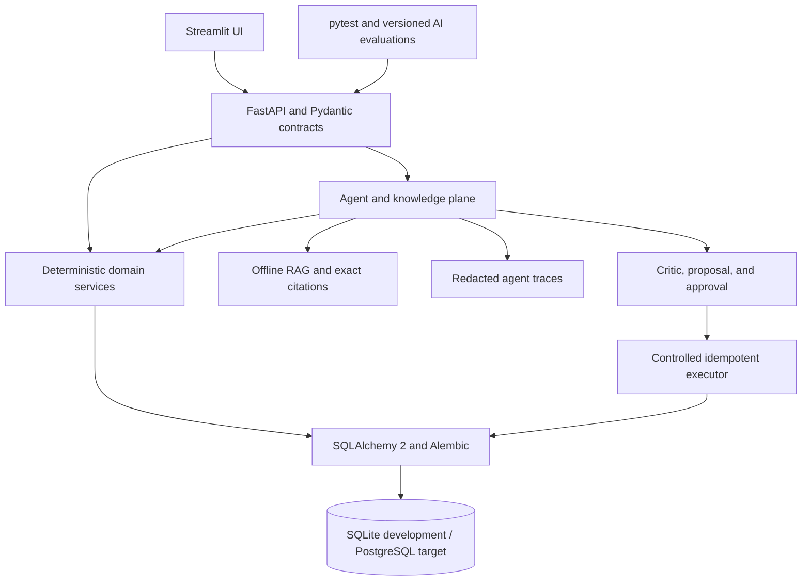

# NourishNest

NourishNest is a production-oriented household nutrition and food-management application. It connects household profiles, nutrition targets, recipes, pantry inventory, meal planning, grocery generation, purchasing, grounded knowledge retrieval, and human-approved agent execution.

The central engineering principle is separation of responsibility:

- AI interprets supported natural-language requests and coordinates bounded, read-only tools.
- RAG supplies household-safe, citation-backed explanatory evidence.
- Deterministic services own calories, nutrients, quantities, conversions, recipe scaling, inventory, shortages, and safety checks.
- A deterministic critic validates agent output.
- A human must explicitly approve an immutable proposal.
- A controlled executor performs the only agent-assisted write—grocery-list creation—exactly once.

## Current status

Implementation is complete through **Phase 10C**.

| Area | Implemented capability |
| --- | --- |
| Household | Households, members, measurements, preferences, allergies, scoped access, and optimistic versions |
| Nutrition | Adult calorie and macronutrient targets with deterministic formulas and warnings |
| Foods | Manual foods plus USDA FoodData Central search, import, refresh, provenance, caching, and retries |
| Recipes | System and household recipes, ingredients, instructions, nutrition, search, editing, and version integrity |
| Pantry | Locations, versioned lots, expiration, FEFO consumption, transfers, adjustments, discards, low-stock rules, and audit events |
| Grocery | Lists and items, requirement and shortage previews, generated lists with lineage, purchases, and optional pantry intake |
| Planning | Pantry-aware recipe ranking, expiring-stock prioritization, weekly meal plans, nutrition summaries, and grocery previews |
| Assistant | Typed intent, clarification, refusals, guardrails, bounded tools, and preview-only planning |
| RAG | Offline ingestion, revisions, deterministic chunking, BM25 retrieval, reranking, exact citations, and injection warnings |
| Multi-agent | Supervisor plus Pantry, Recipe, Nutrition, Grocery, and Knowledge specialists with typed state and durable redacted traces |
| Human control | Deterministic critic, immutable proposals, explicit approval, controlled execution, and exactly-once replay protection |

## End-to-end workflow



## System architecture



### Technology stack

- **Frontend:** Streamlit
- **API:** FastAPI
- **Contracts and validation:** Pydantic
- **Persistence:** SQLAlchemy 2
- **Migrations:** Alembic
- **Development database:** SQLite
- **Production database target:** PostgreSQL
- **HTTP integrations:** httpx
- **Retrieval:** deterministic BM25-style lexical retrieval
- **Reranking:** deterministic term, phrase, title, heading, and source-priority signals
- **Testing:** pytest
- **Static analysis:** Ruff
- **Environment and dependency management:** uv

## AI and agentic capabilities

### Assistant provider modes

| Mode | Use | External model | API cost |
| --- | --- | --- | --- |
| `disabled` | Safe default | None | $0 |
| `fake` | Deterministic local demo and evaluation | None | $0 |
| `ollama` | Optional local-language interpretation | Local Ollama process | $0 API cost |

The project does not require Ollama. Use `APP_AI_PROVIDER=fake` for the reproducible free demo.

### Multi-agent design

The Phase 10B runtime contains one supervisor and five specialists:

| Agent | Responsibility |
| --- | --- |
| Supervisor | Validate intent, select specialists, enforce budgets, order work, and synthesize typed results |
| Pantry | Read stock, expiration, and low-stock information |
| Recipe | Select accessible recipes under household constraints |
| Nutrition | Calculate recipe, member, daily, and weekly nutrition through deterministic services |
| Grocery | Calculate requirements and pantry shortages |
| Knowledge | Retrieve approved evidence with exact RAG citations |

Agents are read-only. They cannot call arbitrary functions, create other agents, recursively delegate, change permissions, or mutate domain records.

### Bounded orchestration

- Typed request, state, tool arguments, and outputs
- Allowlisted agent-to-tool permissions
- Maximum agent and tool-call budgets
- Stable execution ordering
- Timeouts, cancellation, and partial-failure behavior
- Household isolation
- Durable traces containing safe summaries, statuses, tool names, warnings, and timing
- No stored secrets, full prompts, document bodies, or chain-of-thought

## RAG architecture

Phase 10A implements an offline, auditable retrieval pipeline:

1. Accept an approved local text or Markdown source.
2. Validate and normalize its content.
3. Create a stable content hash and document revision.
4. Apply deterministic structure-aware chunking with overlap.
5. Persist chunks, ordering, visibility, and source metadata.
6. Retrieve candidates with BM25-style lexical scoring.
7. Rerank using explainable deterministic signals.
8. Return exact stored excerpts and structured citations.
9. Flag common prompt-injection language as untrusted evidence.

RAG is used for explanatory nutrition, food-safety, storage, preparation, and household guidance. It is not authoritative for calories, nutrients, unit conversion, recipe scaling, pantry quantities, expiration state, shortages, permissions, or database mutations.

## Critic, approval, and controlled execution

Phase 10C adds a human-controlled action boundary:

1. Multi-agent planning produces a read-only result.
2. The deterministic critic checks household scope, allergens, dietary constraints, quantities, lineage, citations, tool budgets, injection warnings, and source-run integrity.
3. An eligible result becomes an immutable grocery-action proposal.
4. Canonical identifiers, Decimal strings, versions, timestamps, lineage, and calculation versions are hashed with SHA-256.
5. A human explicitly approves the matching proposal hash.
6. Approval performs no grocery or pantry write.
7. A separate controlled executor revalidates the proposal and creates the grocery list.
8. Database transactions and idempotency provide exactly-once behavior.
9. Replaying the identical execution returns the saved result without duplication.

The executor cannot purchase groceries or mutate pantry inventory.

## Deterministic domain rules

### Nutrition

- Adult-only nutrition calculation
- Mifflin–St Jeor energy estimation
- Goal-aware calorie adjustment with conservative bounds
- Deterministic protein, fat, carbohydrate, and meal allocation
- Structured warnings for incomplete or unsupported inputs

### Quantities and conversions

- Application arithmetic uses `Decimal`.
- Operational quantities use `NUMERIC(18,6)` where applicable.
- Mass, volume, and count remain separate dimensions.
- Compatible quantities normalize to grams, milliliters, or items.
- Density is never guessed.
- Unsupported and incompatible conversions return structured warnings or errors.

### Pantry

- Multiple lots per food and location
- First-expiring-first-out consumption
- Expired, depleted, and discarded status handling
- Optimistic concurrency and PostgreSQL-compatible row-lock queries
- Atomic consume, adjust, transfer, discard, restock, and audit operations
- Database-backed idempotency

### Grocery

- Recipe scaling to desired servings
- Ingredient aggregation by food and canonical dimension
- Point-in-time pantry shortage calculation
- Generated-item lineage
- Versioned list and item updates
- Purchase audit records
- Optional exactly-once pantry intake

### Recipe recommendation

The deterministic ranking formula is:

```text
score = 80 × mean(quantity coverage) + 20 × mean(expiring-stock coverage)
```

Coverage is capped at one per required food and unit. Unsupported conversions contribute zero and generate warnings. Ties resolve by coverage, recipe name, and recipe ID.

## Quick start

### Prerequisites

- Python supported by the project's `pyproject.toml`
- [uv](https://docs.astral.sh/uv/)
- Two PowerShell terminals

### Install and migrate

```powershell
$env:UV_LINK_MODE = "copy"
uv sync --extra dev
uv run alembic upgrade head
```

### Run the free local demo

Terminal 1 — FastAPI:

```powershell
$env:UV_LINK_MODE = "copy"
$env:APP_AI_PROVIDER = "fake"
uv run python -m uvicorn nourish_nest.api:app --host 127.0.0.1 --port 8000 --reload
```

Terminal 2 — Streamlit:

```powershell
$env:UV_LINK_MODE = "copy"
$env:APP_AI_PROVIDER = "fake"
$env:APP_API_BASE_URL = "http://127.0.0.1:8000"
uv run python -m streamlit run streamlit_app.py --server.address 127.0.0.1 --server.port 8501
```

Open:

- Application: <http://127.0.0.1:8501>
- API health: <http://127.0.0.1:8000/health>
- Interactive API documentation: <http://127.0.0.1:8000/docs>

## Verification

```powershell
uv sync --extra dev
uv run alembic upgrade head
uv run python -m pytest
uv run ruff check .
git diff --check
```

Final documented verification through Phase 10C:

| Suite | Result |
| --- | --- |
| Full software regression | **865 tests passed** |
| Meal-planning assistant evaluation | **49/49 passed** |
| Knowledge retrieval evaluation | **36/36 passed; nine metrics 1.00** |
| Multi-agent planning evaluation | **54/54 passed; accuracy metrics 1.00** |
| Approval and execution evaluation | **58/58 passed; required metrics 1.00** |
| Static analysis | Ruff passed |
| Patch hygiene | `git diff --check` passed |

Run the evaluation suites with:

```powershell
uv run python -m nourish_nest.evals.meal_planning
uv run python -m nourish_nest.evals.knowledge_retrieval
uv run python -m nourish_nest.evals.multi_agent_meal_planning
uv run python -m nourish_nest.evals.approval_execution
```

These evaluations use frozen local datasets, fake providers, and isolated databases. They validate deterministic contracts, retrieval quality, agent/tool selection, constraints, citations, safety, approval transitions, rollback, and idempotency. They do not claim untested open-ended model quality.

## Database migrations

| Revision | Capability |
| --- | --- |
| 0001 | Households, members, dietary preferences, and allergies |
| 0002 | Foods, recipes, ingredients, instructions, nutrition, and unit conversion |
| 0003 | USDA provider provenance |
| 0004 | Pantry locations, lots, stock rules, and transaction history |
| 0005 | Grocery lists and versioned items |
| 0006 | Grocery generations and recipe lineage |
| 0007 | Purchase audit events and pantry-intake linkage |
| 0008 | Member optimistic concurrency |
| 0009 | Recipe optimistic concurrency and creation idempotency |
| 0010 | RAG documents, revisions, chunks, hashes, visibility, and retrieval metadata |
| 0011 | Multi-agent runs and redacted trace steps |
| 0012 | Immutable proposals, approval events, executions, hashes, versions, and idempotency |

## Representative API endpoints

| Domain | Endpoint |
| --- | --- |
| Health | `GET /health` |
| Households | `GET/POST /v1/households` |
| Members | `/v1/households/{household_id}/members` |
| Nutrition | `POST /nutrition/calculate` |
| Foods | `/v1/foods` and `/v1/foods/search` |
| USDA | `/v1/providers/usda/search`, `/foods/{fdc_id}`, and food import/refresh routes |
| Recipes | `/v1/households/{household_id}/recipes` |
| Pantry | `/v1/households/{household_id}/pantry/...` |
| Grocery lists | `/v1/households/{household_id}/grocery-lists/...` |
| Requirements | `POST .../grocery-requirements/preview` |
| Shortages | `POST .../grocery-requirements/shortage-preview` |
| Recommendations | `POST .../recipe-recommendations` |
| Assistant | `POST .../assistant/meal-plan-preview` |
| Knowledge | `POST .../knowledge/retrieve` |
| Multi-agent planning | `POST .../assistant/multi-agent-meal-plan-preview` |
| Proposals and execution | Agent-run proposal, proposal decision, and controlled execution routes |

See the running FastAPI application at `/docs` for the authoritative OpenAPI contracts.

## Configuration

Common environment settings include:

| Variable | Purpose | Typical local value |
| --- | --- | --- |
| `APP_DATABASE_URL` | Database connection | SQLite default or PostgreSQL URL |
| `APP_API_BASE_URL` | Streamlit-to-FastAPI address | `http://127.0.0.1:8000` |
| `APP_FOOD_DATA_PROVIDER` | External food source | `disabled` or USDA mode |
| `USDA_API_KEY` | FoodData Central credential | Secret environment value |
| `APP_AI_PROVIDER` | Assistant interpretation mode | `disabled`, `fake`, or `ollama` |
| `APP_AI_MODEL` | Optional local model | Empty unless Ollama is used |
| `APP_OLLAMA_BASE_URL` | Optional local endpoint | `http://127.0.0.1:11434` |
| `APP_AI_TIMEOUT_SECONDS` | Bounded provider timeout | Configured positive value |

Never commit real credentials or `.env` secrets.

## Safety and reliability controls

- Household-scoped routes and ownership validation
- Consistent structured error envelopes with request IDs
- Pydantic validation and strict enumerations
- Decimal quantity contracts
- Optimistic version checks and stale-write responses
- Database-backed idempotency
- Atomic service transactions and rollback
- Safe-read retries, bounded timeouts, provider error classification, and TTL caching
- Allergen, medical, tenant, injection, permission, budget, and proposal-integrity guardrails
- Explicit confirmation before controlled execution
- No direct agent writes
- Append-only or durable audit evidence for critical workflows

## Current limitations

- Authentication, identity federation, and role-based household authorization are not implemented.
- SQLite is intended for development; live PostgreSQL concurrency has not been fully exercised.
- Meal-plan drafts and conversational presentation state remain session-local.
- Pantry availability and recommendation results are point-in-time estimates without inventory reservation.
- Fake mode demonstrates orchestration, not open-ended language-model quality.
- Ollama is optional and was implemented but not deployed for the documented workflow.
- RAG is lexical and scans an in-memory candidate corpus; embeddings, a vector database, and distributed retrieval are not implemented.
- Prompt-injection detection is heuristic.
- Allergen matching uses normalized stored names without clinical synonym inference.
- Nutrition output is informational and is not medical advice.
- Existing grocery rules permit one generation per list; refunds and purchase reversals are deferred.

## Production roadmap

1. Add authentication, identity-to-household membership, and authorization policies.
2. Deploy and validate PostgreSQL with production concurrency tests.
3. Add CI/CD, secret management, environment promotion, backups, restore testing, and rollback automation.
4. Add structured logging, metrics, alerts, readiness checks, and audit-review tooling.
5. Persist meal plans and privacy-safe conversation summaries.
6. Scale retrieval with source governance, freshness, re-indexing, and semantic evaluation.
7. Evaluate an approved language provider against frozen datasets for quality, latency, cost, privacy, and safety.
8. Expand controlled actions only with dedicated critic, approval, rollback, and audit policies.

## Documentation

- `docs/ARCHITECTURE.md` — application architecture and design decisions
- `docs/PHASE10A_KNOWLEDGE.md` — offline RAG architecture and usage
- `docs/MULTI_AGENT_ARCHITECTURE.md` — supervisor, specialists, tools, and trace model
- `docs/PHASE10A_VERIFICATION.md` — RAG verification evidence
- `docs/PHASE10B_VERIFICATION.md` — multi-agent verification evidence
- `docs/PHASE10C_VERIFICATION.md` — critic, approval, and execution verification evidence
- `docs/PHASE9A_VISUAL_QA.md` — visual design QA

## Disclaimer

NourishNest supports planning and education. It does not diagnose, treat, or replace a physician or registered dietitian. Pregnancy, eating-disorder risk, medical conditions, allergies, and therapeutic diets require qualified professional guidance.
