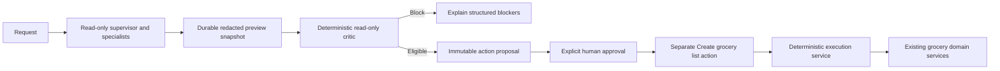
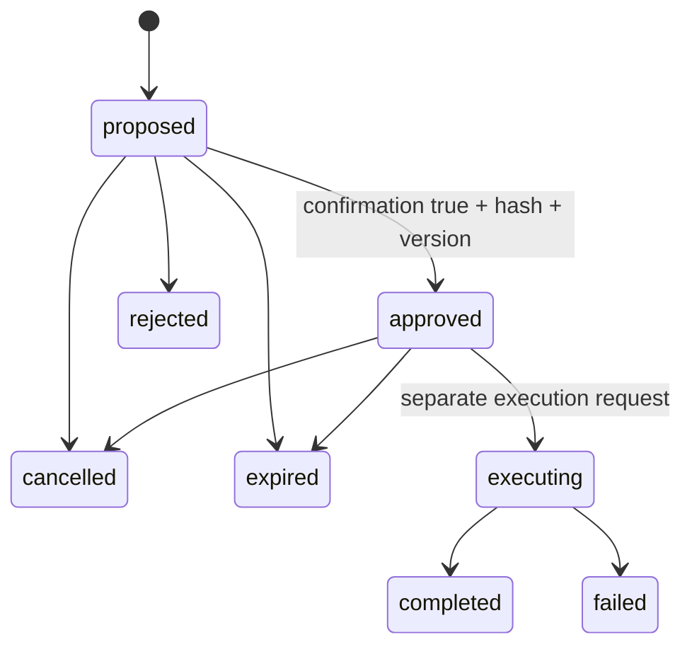
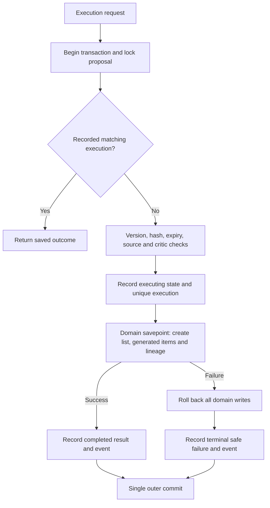

# Human approval and controlled execution — Phase 10C

Completed multi-agent previews can become immutable grocery-list proposals. The critic and agents cannot execute writes. A person reviews the exact name, items and quantities, explicitly approves them, then separately requests creation. Only `create_grocery_list` is supported. No purchasing, pantry consumption/reservation, member edits, recipe/food edits, or household deletion is exposed by this workflow.



The components are separate modules: `approval_critic.py`, `approval_snapshot.py`, `approval_services.py` and `approval_contracts.py`. The existing agent tool registry is unchanged and permits read operations only. Neither proposal creation nor a human decision calls grocery write services. The internal `GroceryGenerationService.persist_shortages` is not an endpoint or registered tool. It is shared with legacy generation to preserve the existing item/lineage logic. `GroceryService(commit=False)` is an explicit, backward-compatible unit-of-work boundary; normal callers retain automatic commits and rollbacks.

## Critic rules and limits

The critic checks a successful run, unchanged run fingerprint and snapshot hash, household/member ownership, adult scope, at most six distinct agents and twelve distinct allowed read-tool calls, required agent success, recipe access, distinct selections, meal count/slot/servings, stored hard allergy exclusions including `may_contain`, dietary/cuisine/time filters, supported calculation versions, and a preview age at most sixty minutes. It checks finite nonnegative quantities that fit `NUMERIC(18,6)` exactly, shortage arithmetic, food/recipe/ingredient lineage against freshly calculated requirements, and pantry-lot ownership. Missing or changed recipe requirements block execution rather than silently changing approved quantities.

Knowledge evidence stores only document/chunk IDs and excerpt hashes. The critic verifies active scoped chunks and matching content. It never runs instructions contained in documents. Prompt-injection warnings are surfaced for review; they do not authorize any additional action. Optional knowledge failure can be a warning; failed required agents block. Unsupported actions and unsafe/minor requests block. Concise codes are exposed, not hidden reasoning.

The critic cannot establish complete allergen-label accuracy, nutritional adequacy, medical suitability, physical pantry freshness, or the approver's identity. Nutrition stays informational. Pantry availability is the reviewed point-in-time estimate, not a reservation; changing pantry stock does not silently change approved grocery quantities. The original free-form request is deliberately not retained. Safety relies on the existing bounded parser/guard and its trusted completed-run evidence, not reconstruction of the original prompt. Existing runs from before migration 0012 have no snapshot and require a fresh preview.

## Lifecycle



| From | Allowed destinations | Domain writes |
|---|---|---|
| completed source run | proposed, only if critic eligible | None |
| proposed | approved, rejected, cancelled, expired | None |
| approved | cancelled, expired, executing | Only execution may begin writes |
| executing | completed or failed | Atomic grocery creation or full domain rollback |
| completed/rejected/cancelled/expired/failed | None | None; identical execution can replay its saved outcome |

Expiry is enforced on decision/execution requests and recorded when encountered. GET does not change database state, so an untouched expired proposal can still display its last stored status alongside its expiry timestamp. Rejection and cancellation do not execute anything. An execution failure is terminal; its identical request replays the failure. A new request cannot silently retry the failed proposal.

## Canonical payload and persistence

Migration `20260913_0012_agent_action_approval.py` adds four tables without editing 0001–0011: `agent_run_snapshots`, `agent_action_proposals`, `agent_approval_events`, `agent_action_executions`. All have household ownership and cascading household deletion; proposals reference their source run, and decisions/executions reference their proposal. Status/action checks, optimistic versions, scoped indexes and database uniqueness enforce the controlled workflow. A unique execution row per proposal is stronger than a single-success constraint: failures cannot acquire a second execution record. Execution result IDs intentionally remain historical references if a grocery list is later deleted through existing unrelated APIs.

The source snapshot contains selected member IDs, normalized intent without prompt/reason/question, ordered meals, shortage evidence, version labels, warning codes and citation hashes. It has a SHA-256 hash and a fingerprint of the source run/steps. No full prompts, document bodies, chain-of-thought or raw client request/idempotency tokens are stored in these new tables.

The execution payload includes household/run IDs, source snapshot hash, normalized list name, sorted recipe selections/names/servings, sorted positive shortages with canonical quantities/units, food names/IDs, ingredient lineage, calculation versions/warnings, and UTC creation/expiration timestamps. Dictionary keys are sorted, UUIDs use standard lowercase strings, Decimal values use fixed-point strings without unnecessary trailing zeros, and list-name whitespace is collapsed. The SHA-256 input is UTF-8 compact JSON with sorted keys and no NaN. Approval/execution recalculate the hash and rebuild the expected payload from server evidence. Client UI state never supplies executable item data.

SHA-256 detects accidental or unauthorized payload changes within the application's trust boundary. It is not a signature and does not protect against a privileged database administrator rewriting the complete evidence chain. No authenticated `approved_by` field is accepted. Request IDs and idempotency keys are stored only as hashes; response request IDs retain the existing middleware behavior.

## Atomicity, retries and concurrency



SQLite obtains `BEGIN IMMEDIATE` before reading approval state; its single-writer lock serializes independent sessions. PostgreSQL uses `SELECT FOR UPDATE` plus version-qualified ORM updates. Unique `(household_id, idempotency_key_hash)` and unique `proposal_id` constraints protect against duplicate execution across processes. The request fingerprint covers proposal ID, expected version, payload hash and key; changing any field conflicts. Identical retries are resolved before stale-version checks and replay the recorded result. Concurrent SQLite executions are tested with two independent sessions and a barrier; exactly one creates domain records.

SQLite lock contention can return `approval_concurrency_conflict`; retry the identical request after the lock clears. PostgreSQL lock SQL is compilation-tested, not exercised against a live PostgreSQL server in this offline phase. Cross-proposal key collisions can surface the generic concurrency conflict on a racing insert, then `idempotency_conflict` on retry. These are database-local exactly-once effects, not distributed exactly-once delivery. A process crash before the outer commit rolls back all execution changes; a crash after commit is recoverable through the durable replay. Existing domain edit APIs are not globally serialized with every critic read; reviewed quantities remain immutable, and recipe access/lineage are rechecked immediately before writing, but this is not a general serializable snapshot or inventory reservation system.

## API and Streamlit

All routes begin `/v1/households/{household_id}/assistant`:

| Method | Suffix | Purpose |
|---|---|---|
| GET | `/runs/{run_id}/critic` | Read-only eligibility review |
| POST | `/runs/{run_id}/proposals` | Create immutable proposal |
| GET | `/proposals` | Scoped proposal history |
| GET | `/proposals/{proposal_id}` | Review stored proposal |
| POST | `/proposals/{proposal_id}/approve` | Strict boolean `confirmation=true`, expected version and hash |
| POST | `/proposals/{proposal_id}/reject` | Reject with expected version |
| POST | `/proposals/{proposal_id}/cancel` | Cancel with expected version |
| POST | `/proposals/{proposal_id}/execute` | Separate approved execution with version, hash and stable key |

Cross-household records return structured 404. Stale versions, invalid transitions, hash conflicts, expired proposals and idempotency conflicts use structured 409 responses with the existing request ID. Invalid input uses the existing 422 envelope. No previous endpoint was removed or repurposed.

On AI Assistant, enable **AI-assisted, human-approved grocery workflow**. Enter a complete request, review the meal/shortage/citation preview and critic result, name and prepare a proposal, review its exact items, check the approval checkbox, press **Approve**, then separately **Create grocery list**. Reject and cancel are available before execution. IDs and trace details stay in collapsed Technical details. State and retry keys survive reruns and navigation in the same Streamlit session. A disconnected execution response can be retried with the identical key; successful submissions disable the creation button. This is session persistence, not durable cross-browser sign-in recovery.

Household selection is not production authentication. An API caller who knows a household ID can act within that household. This phase does not claim cryptographic proof of who approved. Authentication/authorization, inventory reservation, compensating reversal and externally distributed execution are future work.

## Offline local demo and evaluation

With cached dependencies and `UV_OFFLINE=1`:

```powershell
uv run python -m nourish_nest.evals.approval_execution
uv run python -m nourish_nest.evals.approval_smoke
uv run python -m nourish_nest.evals.approval_smoke --serve
```

The last command starts disposable synthetic data on API port 18630 and Streamlit port 18631. Press Enter in its terminal to stop both servers and remove its database. The default fake/rule-based route never invokes Ollama or a cloud provider. Reports under `artifacts/ai-evals/approval-execution-v1/` include applicable-case metric denominators, a 100% required correctness threshold, p95 execution latency below 5000 ms, and API mutation hashes. Any failed case produces a nonzero evaluation exit code.
