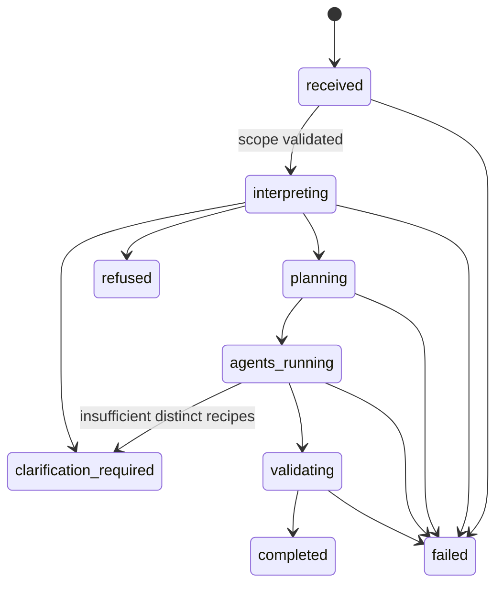
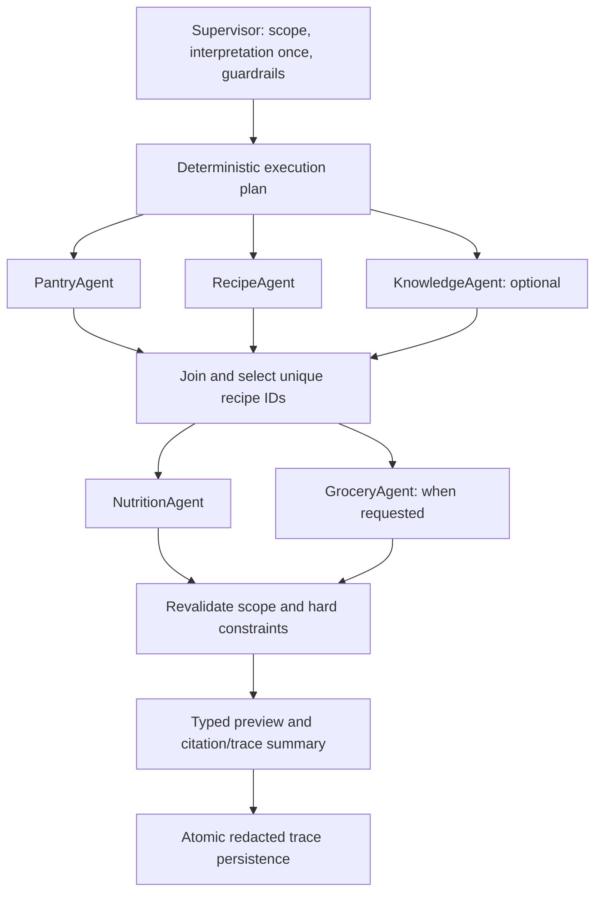

# Phase 10B: bounded multi-agent meal planning

This application-controlled workflow runs completely offline in deterministic, free
fake/rule-based mode. No real LLM, Ollama, embedding model or multi-agent framework is
required or invoked. It produces informational meal previews, not medical advice or a
complete diet. All domain actions remain preview-only; Phase 10C approval gates are future work.

## Supervisor and specialists

An agent has a responsibility, typed input/output, a fixed tool permission set, execution
status, warnings/failure code and trace metadata. A tool is an allowlisted deterministic
operation, not an agent. Agents never create/delegate to other agents. The supervisor
constructs the fixed two-stage plan, selects unique recipe IDs, distributes them into
meal slots, validates and merges typed outputs. It performs no nutrition or inventory math.

| Agent | Responsibility | Input → output | Permitted tools |
|---|---|---|---|
| Supervisor | Scope, plan, bounds, selection, final validation | ScopeInput/AgentInput/SelectionInput → ScopeEvidence/ExecutionPlan | validate_scope, validate_selection |
| Pantry | Availability, expiring lots and low stock | AgentInput → PantryEvidence | read_pantry_summary, read_expiring_inventory |
| Recipe | Ranked candidates with hard exclusions | AgentInput → CandidateEvidence | recommend_recipes |
| Knowledge | Explanatory evidence and citations | AgentInput → KnowledgeEvidence | retrieve_knowledge |
| Nutrition | Existing nutrition aggregation and adult comparisons | SelectionInput → NutritionEvidence | calculate_recipe_nutrition OR get_member_nutrition_target |
| Grocery | Combined requirements and shortages | SelectionInput → GroceryEvidence | preview_recipe_requirements, preview_grocery_shortages |

The registry declares descriptions, agent ownership, request/response model classes,
read classification and timeout policy for every tool. Unknown names, wrong agents,
write classification, malformed arguments, scope changes, repeated tool calls and exhausted
budgets fail before execution. Every attempted invocation is traced, including denials.
Unknown tool names are recorded as `unknown_tool`, never as arbitrary user text.

## State and concurrency



`RunState` contains request/run IDs, household/member scope, transient original request,
intent/constraints, execution plan, tool counts/limits, candidate and selected recipes,
pantry/nutrition/grocery/knowledge evidence, warnings, clarification/refusal, status,
calculation versions and timestamps. Transitions are explicit; terminal states cannot restart.
Agents exchange typed models, not free-form dictionary messages. Technical maps only hold
named calculation versions and redacted audit summaries.



`asyncio.TaskGroup` controls sibling tasks. Blocking SQLAlchemy work uses separate
thread-owned connections/sessions, never a shared request session. SQLite workers set
`PRAGMA query_only=ON`, install cooperative cancellation checks before SQL and a SQLite
progress handler, then roll back and restore connection settings. PostgreSQL read-only
transactions are supported in code but not live-tested in this offline phase.

Limits: six agent executions **including the supervisor**, 12 top-level deterministic
tool invocations, one interpretation and one knowledge retrieval/reranking pass. Typical
five-meal requests execute six agents and nine tools. Repeated tools are prohibited;
there are no retries, recursion or arbitrary delegation. Existing service internals
(recommendation scans and batched member targets) may make multiple SQL/calculation calls;
the budget counts declared tool invocations, not SQL statements or per-ingredient operations.

Defaults: overall active-work deadline 30 seconds, specialist/tool deadline 10 seconds.
`APP_MULTI_AGENT_TIMEOUT_SECONDS`, `APP_MULTI_AGENT_STEP_TIMEOUT_SECONDS`,
`APP_MULTI_AGENT_TOOL_LIMIT`, and `APP_MULTI_AGENT_AGENT_LIMIT` configure bounded limits
(maximum 120 seconds, 60 seconds, 12 tools and 6 agents respectively).
Cancellation drains workers before returning: no hidden reads or writes outlive a response.
Deadlines are cooperative, not hard process termination; driver connection/lock waits,
worker cleanup and the final audit transaction can add latency beyond the active-work
deadline. Production deployment needs driver-level statement/connection timeouts and
admission control; Python cannot forcibly terminate a blocked worker thread safely.

Independent reads are separate snapshots, not a single atomic database snapshot. Every
completed preview includes `stale_read_warning`. Final recipe/household/allergen checks
fail closed if their data is no longer eligible, but there is no stock reservation.
Results merge in fixed agent/recipe/slot/warning/citation order, not task-completion order.
Trace sequence numbers express logical agent order; timestamps show actual chronology.

## Interpretation, constraints and deterministic boundary

The new rule interpreter extends Phase 8's normalization and declared grammar with
`create`, written numbers, adult servings, supported cuisine names, named allergens,
seven-day expiry prioritization, maximum missing ingredients and candidate limits.
It never calls the Phase 8 provider factory; changing `APP_AI_PROVIDER` cannot activate
Ollama or a cloud provider here. Required meal count (1–7), meal slot and servings must
be present. Unknown constraints, repeats, unsupported cuisines or insufficient candidates
produce clarification, not relaxed constraints or guessed values.

Example:

> Create five vegetarian dinners for two adults, prioritize food expiring this week,
> stay under 35 minutes, avoid peanuts, and show the grocery shortages.

`under 35 minutes` means total preparation plus cooking ≤34 minutes; `within`/`at most`
are inclusive. Servings are Decimal. The candidate cap is 50 and each selected meal
uses a distinct saved eligible recipe. Cuisine matching uses the documented fixed
grammar and stored case-insensitive names, not semantic inference.

Existing `RecommendationService` supplies coverage/expiry scores. Optional internal
arguments use requested servings and a seven-day expiry window without changing existing
API defaults. An expiry preference stably partitions the existing ranked candidates;
no new nutritional/ranking formula is invented. Existing `dietary_check` requires stored
tags on every ingredient. Explicit and selected-member allergies exclude both `contains`
and `may_contain`, with conservative singular/plural normalization. Missing allergen
metadata is not a safety guarantee; verify ingredient labels. Custom member preferences
that cannot be verified stop the workflow.

Nutrition uses `serving_nutrition`, `calculate_recipe_nutrition`, existing Phase 8
`summarize`, and saved-member target services. Missing values propagate as `null` plus
warnings. Daily/weekly totals cover all requested servings and only selected meal slots.
Adult comparisons show per-person selected-meal totals and differences from full-day
targets; they are not claims of nutritional adequacy. Selected minors require clarification
and receive no adult targets. Grocery requirements/shortages come directly from existing
preview services, using all selected recipes together to avoid separately consuming stock.

Pantry evidence uses safe repository reads. Low-stock uses the existing calculation with
an optional `as_of` filter, excluding expired lots and incompatible dimensions. Defaults
for existing callers remain unchanged. No expiry-marking summary or expiry mutation runs.

## RAG and safety boundary

Phase 10A RAG remains lexical. It provides explanatory evidence only; it never determines
stock, calories/macros, scaling, allergens, shortages or purchases. One bounded optional
`knowledge_question` is submitted; otherwise the default query concerns storage/handling.
Every knowledge statement is an exact cited excerpt. The answer field only introduces
the citations; it does not invent or synthesize advice. No evidence yields an explicit
message and `no_relevant_evidence`. Retrieved instructions remain untrusted data and their
Phase 10A warnings propagate; documents cannot select tools or change permissions.

Guardrails refuse medical treatment/diagnosis, health guarantees, starvation/eating-disorder
encouragement, hidden prompts/reasoning, safety overrides, cross-household instructions
and domain mutations. This local grammar conservatively refuses calorie-target requests
rather than attempting medical interpretation. Guardrails are deterministic heuristics,
not a general clinical or adversarial-language classifier. Unsupported text clarifies.

An optional KnowledgeAgent timeout/failure may return a completed deterministic preview
with `partial=true`, `partial_agent_failure` and `knowledge_unavailable`. Scope/authorization
or hard-constraint failures always stop the run. Required-agent failures cancel siblings
and suppress the meal plan. Structured failure codes include `agent_timeout`,
`workflow_timeout`, `tool_budget_exceeded`, `agent_budget_exceeded`, `unauthorized_tool`,
`tool_validation_error`, `household_isolation_failed`, and `orchestration_failed`.
Clarification/refusal responses include their status/reason without hidden chain-of-thought.

Existing household scope checks are preserved, but this phase does not add authentication
or PostgreSQL RLS. Household URL IDs are not user authorization. Do not expose the local
API to untrusted tenants without an authenticated scope layer.

## Trace persistence and privacy

Migration `20260913_0011_multi_agent_execution_trace.py` adds `agent_runs` and `agent_steps`.
Durable traces are justified because production audits must survive a response or restart.
Only these audit tables may be written by the coordinator, outside read-only workers.
No trace mutation tool is exposed to any agent. Runs cascade with households, steps with
runs; sequence numbers are unique per run, durations/counts are checked and indexed IDs
support household/request lookup. Final trace insertion is atomic and rolls back on failure;
an unaudited success is not returned. Inaccessible initial scopes do not create trace rows.
Abrupt process termination before final persistence is a documented audit gap.

Store normalized bounded intent excluding the knowledge question/reason, selected agent
names, IDs, counts, timing, statuses, versions, failure/warning codes and safe output
summaries. Request IDs are SHA-256 hashed in storage to prevent arbitrary header text
from becoming a secret-bearing log; HTTP request IDs remain unchanged in responses.
Full messages, document bodies, knowledge queries, credentials, chain-of-thought and
arbitrary exception text are not persisted. Worker exceptions become safe outcomes before
crossing cancelled futures, avoiding Python's unhandled-future exception logging.

## Endpoint and local demonstration

New endpoint:
`POST /v1/households/{household_id}/assistant/multi-agent-meal-plan-preview`.
Phase 8 and Phase 10A endpoints remain unchanged. Unknown fields, blank/oversized messages,
invalid member IDs and malformed options use the existing 422 error envelope; inaccessible
scope uses 404. Failed runs use existing structured errors with their code and request ID
(504 for timeouts, 422 for other workflow failures). Completed, partial, clarification and
refusal responses expose typed status, decisions, evidence and traces, never hidden reasoning.

```powershell
$env:UV_OFFLINE = '1'
uv sync --extra dev
uv run alembic upgrade head
uv run python -m uvicorn nourish_nest.api:app --host 127.0.0.1 --port 8000
```

Use an existing household with at least five eligible recipes and reviewed knowledge
documents (see [Phase 10A ingestion](PHASE10A_KNOWLEDGE.md)). From another terminal:

```powershell
$householdId = '<existing-household-uuid>'
$body = @{
  message = 'Create five vegetarian dinners for two adults, prioritize food expiring this week, stay under 35 minutes, avoid peanuts, and show the grocery shortages.'
  member_ids = @()
  include_knowledge = $true
} | ConvertTo-Json
Invoke-RestMethod -Method Post -Uri "http://127.0.0.1:8000/v1/households/$householdId/assistant/multi-agent-meal-plan-preview" -ContentType 'application/json' -Body $body
```

This is a local loopback example, not an external network or model call. The evaluation
and smoke tests use in-process TestClient and synthetic temporary databases instead.

## Evaluation and verification

`multi_agent_meal_planning_v1.json` contains 54 original golden cases, including tool/agent
budgets, authorization, failure injection, timeouts, partial knowledge, allergy exclusions,
member/knowledge isolation, no-evidence/injection handling, interpretation and repeated results.
Each case checks domain-table snapshots before/after two executions. Expected nutrition
and shortages are checked against independent direct service calls. Separate tests use
a three-thread barrier to prove actual parallel workers, verify dependency timestamps,
force writes against read-only connections, test trace rollback/redaction and API contracts.

All safety and contract metrics require 1.00 on this small deterministic fixture suite;
p95 latency for completed runs must be ≤5,000 ms, allowing ordinary local machine variation.
Reports state each metric's applicable-case denominator; completion means expected-success
completion. Repeated comparisons exclude run IDs
and timing; failed runs compare failure status/code and suppressed plans because cancellation
timing can vary. These are regression tests, not real-world language-model quality claims.

```powershell
$env:UV_OFFLINE = '1'
uv run python -m pytest tests/test_multi_agent.py tests/test_knowledge.py tests/test_planning.py
uv run python -m nourish_nest.evals.knowledge_retrieval
uv run python -m nourish_nest.evals.multi_agent_meal_planning
uv run python -m pytest
uv run ruff check .
git diff --check
```

Reports are written under `artifacts/ai-evals/multi-agent-meal-planning-v1/`.
For migration round trips, use an isolated temporary `APP_DATABASE_URL`, upgrade to head,
then `uv run alembic downgrade -1`, `uv run alembic upgrade head`, and
`uv run alembic current`. Downgrading 0011 deletes audit history; do not round-trip a
populated real database casually. Migrations 0001–0010 are unchanged.

Future work: authenticated tenant scope, PostgreSQL cancellation/snapshot validation,
admission control, broader evaluated grammar, configurable approved evidence policies,
and Phase 10C explicit approval gates for any domain write. This phase adds no UI,
shopping, inventory consumption, saved meal plans, paid providers or autonomous write agents.
